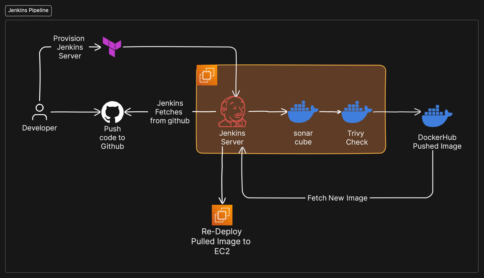
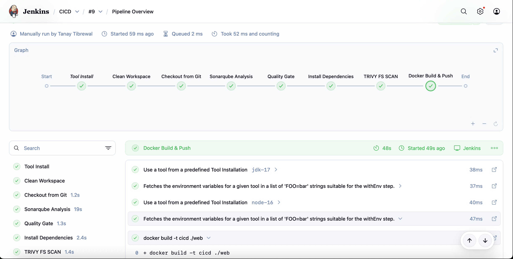

# Web Application CI/CD Pipeline

This project implements a comprehensive DevOps pipeline for a Node.js web application. It automates code quality assurance, security scanning, infrastructure provisioning, and containerized deployment using Jenkins, Docker, and Terraform.

# Architecture



# Pipeline in Action



# Technology Stack

* Version Control: GitHub
* CI/CD: Jenkins
* Containerization: Docker & Docker Hub
* Infrastructure as Code: Terraform
* Cloud Provider: AWS (EC2)
* Code Quality: SonarQube
* Security: Trivy (Filesystem & Image scanning)

# Pipeline Workflow

The Jenkinsfile defines the following automated stages:

* Checkout: Retrieves source code from the repository.
* Static Analysis: Runs SonarQube to identify bugs and code smells; enforces Quality Gates.
* Dependency Security: Uses Trivy to scan local filesystem dependencies for vulnerabilities.
* Build & Push: Builds the Docker image and pushes it to the registry.
* Image Security: Scans the final Docker image with Trivy before deployment.
* Provisioning: Executes Terraform to provision or update the AWS EC2 infrastructure.
* Deployment: Connects to the EC2 instance via SSH to pull and run the application container.

# Prerequisites

Ensure the Jenkins environment is configured with:

* Tools: JDK 17, Node.js 16, Docker, Terraform.
* Plugins: Docker Pipeline, SonarQube Scanner, Trivy, Terraform, SSH Agent.
* Credentials:
  * dockerhub (Registry authentication)
  * SonarQube-Token (API Token)
  * aws-credentials (AWS Access Key ID & Secret Access Key)
  * ec2-server-key (SSH Private Key)

# Usage

Infrastructure Cleanup
To deploy changes, push to the main branch. The pipeline will automatically trigger, test, provision infrastructure, and deploy the application.
To destroy all provisioned resources and prevent further costs, execute the following command within the terraform/ directory:

```bash
terraform destroy --auto-approve
```
